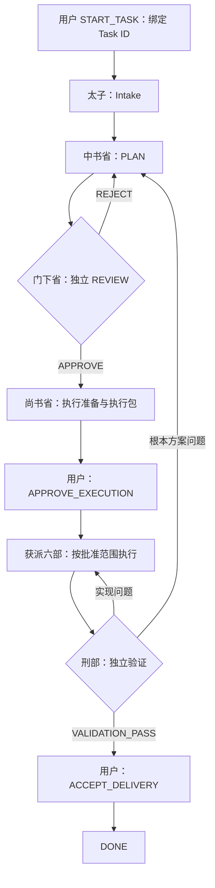
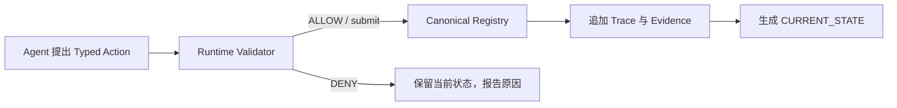

# ImperialFlow · 三省六部 AI 协作工作流

**明确职责，先审方案，按授权执行，以证据交付。**

ImperialFlow 借用三省六部的分工，为 AI 辅助开发与科研建立轻量协作流程。人决定任务启动、重要执行授权和最终验收；Agent 每次承担一个角色，完成一个阶段，提交一个正式 Action 后停止。Python 本地 Runtime 校验状态迁移、角色能力和证据引用，保存可核对的提交记录。

本仓库整理自器件建模项目的实际治理实践，发布可复用的流程说明、角色模板、Runtime 和治理测试。定位为 **V1 本地治理基线**；读者可以先使用职责规范，再按项目情况接入 Runtime。

[流程规则](docs/workflow.md) · [角色职责](docs/roles.md) · [Runtime 使用](docs/runtime.md) · [已知边界](docs/limitations.md) · [模板](templates/README.md)

## 为什么需要这套流程

AI 可以快速写方案和代码，也容易把建议当授权、把自检当独立审查、在执行中悄悄改变方法，或在聊天与文件之间留下相互矛盾的状态。ImperialFlow 用明确的职责和提交门禁约束这些行为：

- **启动有依据**：路线图和“下一任务”只是建议。新任务需要用户明确绑定 Task ID 的启动决定。
- **科学与实现有边界**：方案写清假设、单位、输入输出和验收标准；执行者按批准方案交付。
- **审查保持独立**：方案作者不批准自己的方案，交付作者不独立验证自己的交付。
- **状态只有一个权威**：Registry 记录当前状态；视图由 Runtime 生成；历史证据只追加。
- **每一步有证据**：方案、审查、执行包、授权、验证与验收相互绑定，作废记录保留但失去当前效力。

## 三省六部如何分工

| 角色 | English ID | 主要职责 |
| --- | --- | --- |
| 皇帝 / 用户 | EMPEROR | 启动任务、执行授权、暂停或取消、最终验收 |
| 太子 | PRINCE | Intake：核对状态、分类需求、识别风险、路由任务 |
| 中书省 | ZHONGSHU | PLAN：制定完整、可审查、可执行的方案 |
| 门下省 | MENXIA | REVIEW：独立批准方案或指出问题并退回 |
| 尚书省 | SHANGSHU | EXECUTION_PREP：整理执行包、职责、范围与停止条件 |
| 吏部 | PERSONNEL | AgentOps、Skill、治理协议与受限状态协调 |
| 户部 | REVENUE | 数据、CSV、指标、实验与扫描结果 |
| 礼部 | RITES | README、报告、公式与交付文档 |
| 兵部 | WAR | 代码、算法与工程实现 |
| 刑部 | JUSTICE | 独立交付验证、测试与合理性检查 |
| 工部 | WORKS | 环境、依赖、基础设施与部署 |
| 御史台 | YUSHITAI | 按明确合同审计流程、治理系统与 Checkpoint |

角色是职责标签，可以按任务需要分次复用执行者。独立审查按风险临时安排，不要求常驻 Agent 编队。三省对应方案、审查和执行的逻辑分工；准备、授权等待、验证和验收是必要的门禁与交接。

## 一项 HIGH 风险任务的正常路线



图中的箭头表示下一角色的路由。每次调用只完成自己获派的一步，提交后停止，由可信入口另行打开下一次角色调用。返工受预算限制；方案变更须重新获得对应审查和授权。

## 六条核心规则

1. **NEXT_TASK ≠ AUTHORIZED_TASK**。新任务必须有实际用户的 `START_TASK`，并绑定明确 Task ID；引用、示例或模糊“继续”不产生新任务启动权。
2. **ONE ROLE — ONE STAGE — ONE ACTION**。一次正式 Invocation 只完成一个角色的一个阶段和一个最终 Action。
3. **批准绑定具体版本**。HIGH / CRITICAL 执行依赖当前有效方案的独立审查、绑定该方案的执行包，以及适用的用户执行授权。
4. **结果、路由、动作分开记录**。`VALIDATION_PASS` 是验证结果；`REQUEST_IMPERIAL_ACCEPTANCE` 才是请求验收的 Action。
5. **验证通过后等待验收**。只有实际用户的 `ACCEPT_DELIVERY`，且满足验证门禁，才使普通交付任务进入 `DONE`。
6. **冲突时停止提交**。不猜测授权，不复用 `VOID / UNAUTHORIZED` 记录，不覆写历史。

## 风险分级

| 风险 | 规范中的技术路线 | 常见任务 |
| --- | --- | --- |
| LOW | EXECUTE | 不改变核心方法的普通文档、样式与小修改 |
| MEDIUM | PLAN → EXECUTE | 已明确方法下的局部功能 |
| HIGH | PLAN → REVIEW → EXECUTE | 模型、算法定义、实验评价方法、核心架构 |
| CRITICAL | PLAN → REVIEW → EXECUTE → FINAL REVIEW | 基础方法全面调整、跨版本或难回退变更 |

风险路线表达技术审查要求，启动和适用的授权、验收门禁仍需满足。**V1 Runtime 已提供 LOW 直接执行边和完整 HIGH 门禁；MEDIUM 简化跳转、CRITICAL 自动 FINAL REVIEW 路由尚未提供通用实现。** 接入前请阅读[实现边界](docs/limitations.md)。

## 状态如何提交



| 文件 / 对象 | 地位 |
| --- | --- |
| `governance/TASK_REGISTRY.yaml` | 当前状态唯一机器可写权威，通过 Runtime 提交 |
| `governance/CURRENT_STATE.md` | Registry 自动派生的人类可读视图 |
| `governance/tasks/<Task ID>.md` | 只追加的过程与历史证据；旧头部是历史快照 |
| `governance/traces/` | 带序号、前事件哈希与 Registry 哈希的机器事务记录 |
| Agent 聊天与自然语言 | 工作说明，不拥有当前状态权威 |

`check` 只验证，不提交。`submit` 在锁内重新校验修订号、能力、状态边、证据和门禁；成功提交后该 Invocation 不能再次产生最终 Action。

## 本地快速体验

参考验证环境为 Python 3.13。以下命令在仓库根目录执行；治理测试只使用临时目录中的合成任务。

```powershell
python -m venv .venv-imperialflow
& .\.venv-imperialflow\Scripts\python.exe -m pip install -r requirements-governance-lock.txt
& .\.venv-imperialflow\Scripts\python.exe -m unittest discover -s tests/governance -p 'test_*.py' -v
& .\.venv-imperialflow\Scripts\python.exe -m imperialflow --help
```

类 Unix 环境可将 Python 入口换成 `.venv-imperialflow/bin/python`。本仓库不附真实项目 Registry、皇帝决定或任务历史；新克隆可直接运行测试和查看 Schema，`status / begin / submit` 则需要项目自身已初始化、经核对的 Registry。V1 没有通用新项目初始化命令，不能把测试里的合成决定当作用户授权。

## 已实现与边界

现有 Runtime 实现 Pydantic Typed Action、角色 Action 白名单、状态边校验、证据区段与哈希、审查独立性校验、作废记录拒用、排他锁、修订号、可恢复事务日志、Trace 链、派生视图和轻量返工预算。临时需求通过 Interrupt 分类；Checkpoint 审计与普通交付验收分开。

它运行在**可信本地调用者**模型下。共享文件系统仍可被外部工具改写，身份由调用者提供；当前没有 OS 角色隔离、客户端身份签名、自动 Agent 调度或科研工具代理。哈希证明引用内容一致，不能单独证明用户决定真实。多文件提交靠事务日志恢复，不能表述为所有文件在操作系统层同时原子提交。

完整说明见[已知边界](docs/limitations.md)，本次实际检查结果见[发布验证](docs/verification.md)。

## 仓库目录

```text
ImperialFlow/
├── README.md
├── LICENSE
├── .codex/skills/imperialflow/SKILL.md
├── docs/                 # 工作流、职责、Runtime、边界与验证
├── templates/            # 项目入口与阶段文档模板
├── imperialflow/          # 本地治理 Runtime 与机器 Schema
├── tests/governance/      # 合成任务治理测试
└── requirements-governance*.txt
```

建议先阅读 README 和模板，再将流程接入自己的项目。模型假设、数据来源、工具能力和验收标准由项目合同定义；ImperialFlow 不替项目补造这些内容。

## 贡献与许可

欢迎提交流程说明、可复现问题与合成治理用例，参见[贡献约定](CONTRIBUTING.md)。许可证为 [MIT](LICENSE)，标准文本来源为 [Open Source Initiative](https://opensource.org/license/mit)。
